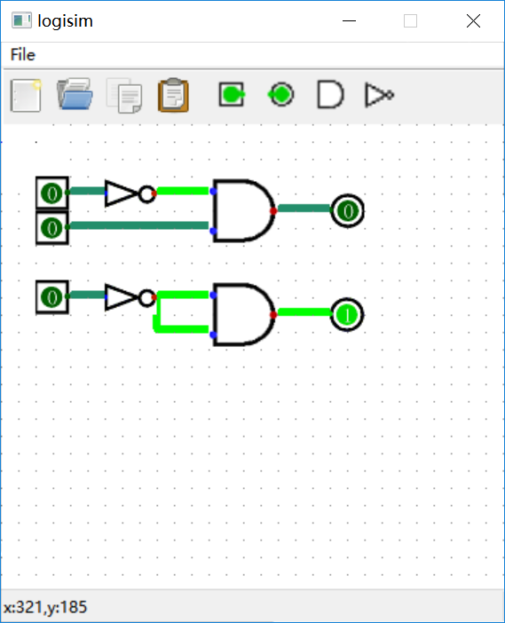
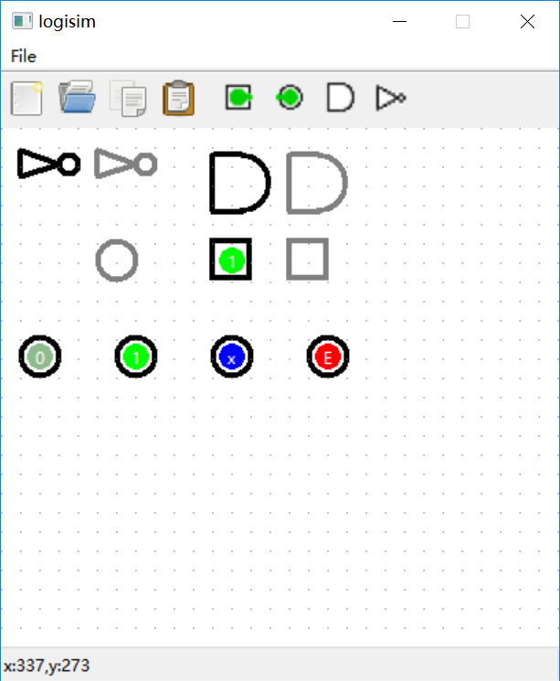
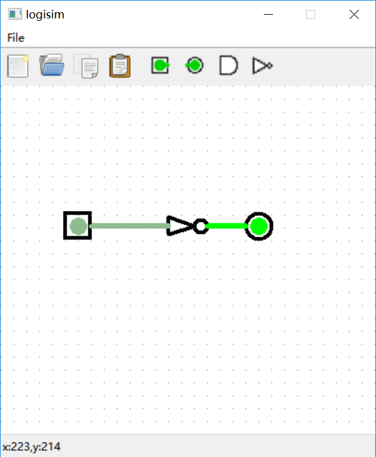

## 更新日志

### 11.14 

python大作业下发

### 11.28 

zyh提出idea

### 11.31 

zyh开工并完成框架（关于、退出、工具栏、状态栏）

### 12.1

zyh完成格点设计、工具栏bind事件

my完成基本事件（放置门，对齐网格）、基础连线（黑线）

drawline真的不太会搞......

参考资料：

[Getting Started with wxPython](https://blog.csdn.net/chenghit/article/details/50421090)

[wxpython编写的简单划线工具](https://blog.csdn.net/sileiam/article/details/17152005)

笔记：设置一下pen和brush就可以实现填充与否、线的颜色和宽度了（12.2凌晨）

### 12.2 

my完成基本bfs设计以及基础连线（包括折线方向问题，但比较粗糙，存在不少bug）

效果：

大致框架已经具备，但可以观察到的是，从外界复制过来的bmp图存在遮挡线条的bug，同时因为bmp是一个类似panel的东西，会阻止鼠标事件的响应。同时，存在绘图刷新频率过高、闪烁的现象。同时由于对齐格点使用向下取整，只能从output的端口右下小范围拉线

第一版结束。

目标：将所有图直接使用线条画，同时改变对齐逻辑，同时解决以上bug。

### 12.3

通过device context解决闪烁问题（找了好久资料...来直接奉上来点，方便）

[wxpython之解决闪烁](https://blog.csdn.net/webzhuce/article/details/72802670)
[给wxPython事件处理函数传递参数](https://segmentfault.com/a/1190000000487499)
[wxpython之DC绘图](https://blog.csdn.net/m0_37816922/article/details/99582939)
[【wxpython】设备上下文简介](https://blog.csdn.net/linuxarmsummary/article/details/78838417)

成功手动画出各种门，但无法解决statictext无法跟随移动的问题（静态文本移动个锤子）

[wxPython控件学习之wx.StaticText](https://www.cnblogs.com/ankier/archive/2012/09/16/2687945.html)

改动bfs逻辑，修改小bug，添加鼠标悬浮在可画线点上时显示小绿圈的功能，添加左键拖拽和左键右键删除的功能，添加右键改变input gate value的功能，添加从工具栏选择门时右键可以取消选择的功能。

大致效果如下：

### 12.4  

修改颜色，修bug，删除无关工具栏按钮，第二版结束（就是当前的版本）。

### 12.11 

答辩结束，暂告一段落。（吐槽：为啥答辩全场不是pygame就是爬虫？）

目前存在的缺陷：

网格有时候无法对齐；

线无法删除；

采用bfs，无法仿真电路；

无法显示文字；

位数无法修改。

## 特别地

纪念一下第一个和zyh合作的作品~